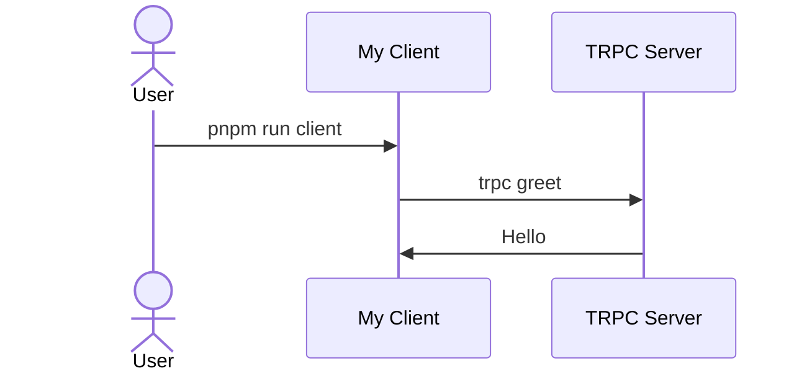

# pnpmのworkspaceでクラサバ

[trpc](https://trpc.io/)を使ってみたかったので、クライアントとサーバーに分けてシンプルな構成でモノレポの骨組みを作ってみます。こんな感じのものができる予定。
trpcはスキーマ無しでAPIをクライアント側で簡単に使える的なアレ。




## 基本構造
```
.
├── client
│   └── (クライアント関連はここ)
├── server
│   └── (サーバー関連はここ)
```


## pnpmまわり

今回のサンプルでは、パッケージマネージャーに[pnpm](https://pnpm.io/) を利用します。

### pnpm関連のファイル構成

Rootにはpackage.jsonの他に、pnpm-workspace.yamlを配置、client/serverにはそれぞれpackage.json

```
.
├── client
│   ├── package.json
├── server
│   ├── package.json
├── package.json
├── pnpm-workspace.yaml
```

### pnpm init 

(プロジェクトroot)/package.jsonをコマンドで作成

```console
cd (root) #　プロジェクトのrootフォルダに移動
pnpm init
pnpm add -D typescript @types/node @tsconfig/node18-strictest-esm
```

(root)/pnpm-workspace.yamlは下記内容で手動で作成

```yaml
packages:
  - "server"
  - "client"
```

rootに関してはこんな感じでOK。次に、client/serverの方。

client/package.jsonをコマンドで作成

```console
cd client
pnpm init
pnpm add @trpc/server @trpc/client
```

server/package.jsonをコマンドで作成

```console
cd server
pnpm init
pnpm add @trpc/server
```


client/package.json
typeをmoduleにして、dependenciesにserverフォルダを追加してこんな感じ。
```json
{
  "name": "@my/client",
  "version": "1.0.0",
  "description": "",
  "main": "index.js",
  "type": "module",
  "scripts": {
    "test": "echo \"Error: no test specified\" && exit 1"
  },
  "keywords": [],
  "author": "",
  "license": "ISC",
  "dependencies": {
    "@my/server": "workspace:*",
    "@trpc/client": "^10.7.0",
    "@trpc/server": "10.7.0"
  }
}
```

server/package.json
こっちもtypeをmoduleにしたりしてこんな感じ
```json
{
  "name": "@my/server",
  "version": "1.0.0",
  "description": "",
  "main": "index.js",
  "type":"module",
  "scripts": {
    "test": "echo \"Error: no test specified\" && exit 1"
  },
  "keywords": [],
  "author": "",
  "license": "ISC",
  "dependencies": {
    "@trpc/server": "^10.7.0"
  }
}

```


## typescript まわり
tsconfigがrootをclient/serverそれぞれに。

### tsconfig関連のファイル構成

client/serverの配下にある、tsconfig.jsonはrootにtsconfig.base.jsonを置いて継承するような感じにする。

```console
.
├── client
│   └── tsconfig.json
├── server 
│   └── tsconfig.json
├── tsconfig.base.json
└── tsconfig.json
```

rootのtsconfig.jsonの中身

こいつは、client/serverへのリファレンスを持つ感じ。

```json
{
  "extends": "@tsconfig/node18-strictest-esm/tsconfig.json",
  "files": [],
  "references": [
    {
      "path": "./server"
    },
    {
      "path": "./client"
    }
  ],
  "include": [],
  "exclude": [
    "**/node_modules",
    "**/dist"
  ],
  "compilerOptions": {
    "lib": [
      "esnext"
    ],
  }
}
```

client、server配下のtsconfig.jsonの共通部分をtsconfig.base.jsonに記述

```json
{
  "extends": "@tsconfig/node18-strictest-esm/tsconfig.json",
  "exclude": [
    "**/node_modules"
  ],
  "compilerOptions": {
    "composite": true,
    "lib": [
      "esnext"
    ], 
    "resolveJsonModule": true,
    "moduleResolution": "node",
    "declaration": true,
    "noEmitOnError": true,
    "allowSyntheticDefaultImports": true,
    "checkJs": false,
  }
}
```

これを継承した、client/tsconfig.jsonはこんな感じ。client側はserverのソースを利用するので、`referenceにserver`を入れている。

```json
{
  "extends": "../tsconfig.base.json",
  "compilerOptions": {
    "rootDir": "./",
    "outDir": "./dist"
  },
  "references": [
    {
      "path": "../server"
    },
  ],
  "exclude": ["./dist/**/*"],
}
```

これを継承した、server/tsconfig.jsonはこんな感じ。

```json
{
  "extends": "../tsconfig.base.json",
  "compilerOptions": {
    "rootDir": "./",
    "outDir": "./dist"
  },
  "exclude": ["./dist/**/*"],
}
```

## サーバー構築

シンプルに 1 tsファイル

```console
.
├── server 
│   └── index.ts
```

server/index.ts

```typescript
import { initTRPC } from '@trpc/server';
import { createHTTPServer } from '@trpc/server/adapters/standalone';

export type AppRouter = typeof appRouter;

const t = initTRPC.create();

const publicProcedure = t.procedure;
const router = t.router;

const appRouter = router({
  greet: publicProcedure
    .input((val: unknown) => {
      if (typeof val === 'string') return val;
      throw new Error(`Invalid input: ${typeof val}`);
    })
    .query(({ input }) => ({ greeting: `hello, ${input}!` })),
});

createHTTPServer({
  router: appRouter,
  createContext() {
    return {};
  },
}).listen(2022);
```

## クライアント構築

こっちもシンプルに 1 tsファイル

```console
.
├── client 
│   └── index.ts
```

client/index.ts

```typescript
import { createTRPCProxyClient, httpBatchLink } from '@trpc/client';
import type { AppRouter } from '../server';

const client = createTRPCProxyClient<AppRouter>({
  links: [
    httpBatchLink({
      url: 'http://localhost:2022',
    }),
  ],
});

async function main() {
  const result = await client.greet.query('tRPC');

  // Type safe
  console.log(result.greeting.toUpperCase());
}

main();
```

## ビルド

### rootのpackage.jsonにコマンドを追加

```json
{
  ...,
  "scripts": {
    "build": "tsc",
    "start:server": "node server/dist",
    "start:client": "node client/dist",
    "test": "echo \"Error: no test specified\" && exit 1"
  },
  ...,
}

```

### ビルド

プロジェクトのrootフォルダにて

```console
npm run build
```

## 動作確認

### サーバー起動

```console
npm run start:server
```

### クライアント実行

```console
npm run start:client
```